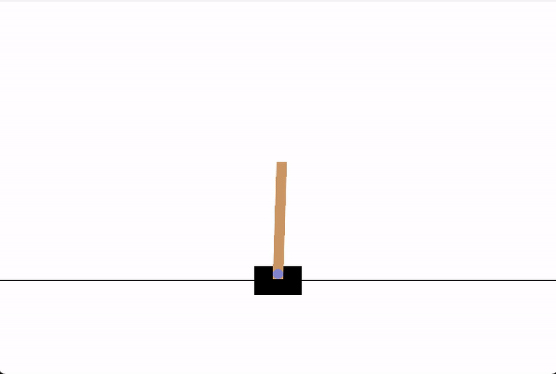

# CartPole Q-Learning Implementation

A tabular Q-learning implementation for solving the CartPole-v1 environment from Gymnasium.

## Overview

Built from gymnasium's example for a blackjack agent. 

This implementation uses:
- Discretized state space with adjustable bin sizes
- Epsilon-greedy exploration strategy with decay
- Q-learning update rule for value iteration

## Features

- Simple yet effective Q-learning agent
- Configurable hyperparameters
- Performance tracking (rewards, episode lengths, training error)
- Visualization of training metrics
